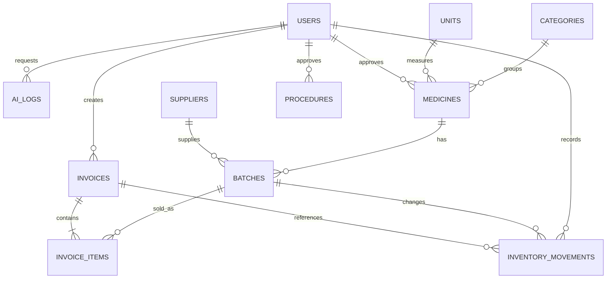

# Thiết kế hệ thống và quy tắc nghiệp vụ

## Kiến trúc

React gọi `/api` cùng origin với Vite. Vite proxy đến FastAPI; FastAPI truy cập PostgreSQL qua SQLAlchemy + psycopg. Chỉ module `app/ai.py` gọi Gemini. Mọi tác vụ AI là đọc và trích chọn; không có tool cho AI cập nhật dữ liệu nghiệp vụ.

- Python 3.11+, hướng dẫn chuẩn dùng 3.12.
- React 19, Vite 6, CSS thuần, Lucide icons; font có fallback hệ thống nếu Google Fonts không tải được.
- PostgreSQL 16 trong Docker Compose, dữ liệu lưu volume. DB chỉ bind loopback.
- Thiết lập local dùng HTTP loopback. Khi triển khai thật cần HTTPS và cấu hình cookie/origin phù hợp.

## Mô hình quan hệ

| Bảng | Dữ liệu / vai trò |
|---|---|
| users | Tên đăng nhập duy nhất, hash mật khẩu, vai trò, trạng thái, phiên bản token |
| categories | Danh mục nhóm thuốc |
| units | Đơn vị tồn kho; một mã thuốc một đơn vị |
| suppliers | Tên, liên hệ, địa chỉ, trạng thái |
| medicines | Mã duy nhất, tên, nhóm, đơn vị, ngưỡng tồn, kê đơn, thông tin, nguồn, trạng thái duyệt |
| batches | Mã lô duy nhất trong mỗi thuốc, thuốc, nhà cung cấp, ngày nhập/hạn dùng, giá, tồn |
| invoices | Nhân viên, thời điểm, khách hàng, tổng tiền, trạng thái, phương thức thanh toán, mã chống lặp, hash yêu cầu, mã đơn thuốc, lý do hủy |
| invoice_items | Lô, số lượng, giá nhập/giá bán, tên thuốc và đơn vị tại thời điểm bán |
| inventory_movements | Lô, nhân viên, hóa đơn liên quan, thay đổi số lượng, số dư sau thay đổi, nghiệp vụ và lý do |
| procedures | Tiêu đề, nội dung, trạng thái và người duyệt |
| ai_logs | Người gọi, loại tác vụ, yêu cầu, kết quả, ảnh chụp nội dung nguồn, cảnh báo, trạng thái và model |

Danh mục và quan hệ tránh lặp dữ liệu. `invoice_items` cố ý lưu bản chụp tên/đơn vị/giá để bảo toàn chứng từ lịch sử; `batches.quantity` là số dư phục vụ giao dịch, được cập nhật cùng sổ biến động. Vì có các bản chụp và số dư lưu sẵn, không gọi toàn bộ schema là 3NF thuần túy.

## Quy tắc nhập và tồn kho

1. Lô nhập phải có số lượng nguyên dương; giá không âm, tối đa hai chữ số thập phân.
2. Ngày nhập không được sau hôm nay. Hạn dùng phải sau ngày nhập và sau hôm nay.
3. Không cho sửa trực tiếp số lượng qua CRUD lô. Điều chỉnh qua endpoint kiểm kê và bắt buộc lý do.
4. Kiểm kê gửi `expected_quantity`; nếu tồn hiện tại khác, trả HTTP 409 để tránh ghi đè giao dịch vừa diễn ra.
5. CSDL có CHECK không âm, FK và UNIQUE; xóa danh mục đã được tham chiếu bị chặn.
6. Thuốc đã có lô không được đổi đơn vị tính. Cần tạo mã thuốc mới khi đổi cơ sở quản lý đơn vị.
7. Ngày nghiệp vụ lấy theo `Asia/Ho_Chi_Minh`; timestamp lưu UTC. Python trên Windows dùng gói `tzdata`.
8. HSD bằng hôm nay cũng chặn bán theo quy ước bảo thủ của phiên bản này. Đây là quy tắc phần mềm, không phải khẳng định pháp luật hoặc hướng dẫn dược học.
9. Hàng hết hạn vẫn nằm trong tồn vật lý đến khi được xử lý và ghi nhận kiểm kê. Báo cáo phân biệt tồn vật lý và tồn có thể bán.

## Thanh toán và hủy đơn

- Gộp dòng trùng `batch_id` trước khi kiểm tra tổng số lượng.
- Khóa người lập hóa đơn để tuần tự hóa yêu cầu gửi lại cùng người dùng. Khóa tất cả lô theo thứ tự ID tăng dần để giảm nguy cơ deadlock.
- Kiểm tra tồn, hạn, trạng thái thuốc, đơn tham chiếu, quyền kê đơn, và giá kỳ vọng trước khi ghi hóa đơn.
- Giá thật lấy từ database; `expected_sale_price` từ giỏ chỉ dùng phát hiện thay đổi, không dùng làm giá bán.
- Một transaction bao gồm hóa đơn, chi tiết, giảm tồn và biến động. Có lỗi phải rollback toàn bộ.
- `request_key` duy nhất và `request_hash` phát hiện lặp đúng nội dung hoặc xung đột. Gửi lại đúng yêu cầu trả lại hóa đơn cũ.
- Hủy hóa đơn khóa hóa đơn và các lô, hoàn đúng số lượng một lần. Hủy lặp không cộng tồn thêm.
- Chỉ hỗ trợ hủy toàn bộ sau khi hàng đã được hoàn lại đầy đủ; không có trả hàng một phần.
- Tiền mặt/chuyển khoản chỉ là ghi nhận phương thức; không có tích hợp ngân hàng.
- Lô hiển thị theo FEFO (hạn sớm trước). Nhân viên vẫn chọn lô thực tế, không tự chia số lượng qua nhiều lô.

## Phân quyền

| Nghiệp vụ | Quản lý | Dược sĩ | Thu ngân |
|---|---|---|---|
| Xem thuốc, nhóm, đơn vị, lô, NCC, cảnh báo | Có | Có | Có |
| Thêm/sửa/xóa danh mục, nhập lô | Có | Có | Không |
| Điều chỉnh tồn/giá, xem sổ kho | Có | Có | Không |
| Bán thuốc không kê đơn | Có | Có | Có |
| Bán thuốc kê đơn (phải nhập mã đơn đã kiểm tra) | Có | Có | Không |
| Xem hóa đơn | Tất cả | Tất cả | Do mình lập |
| Hủy hóa đơn và hoàn kho | Có | Có | Không |
| Báo cáo, AI và duyệt nguồn | Có | Có | Không |
| Tạo/khóa tài khoản, nhật ký AI | Có | Không | Không |
| Đổi mật khẩu cá nhân | Có | Có | Có |

Quản lý chỉ nên được cấp quyền duyệt/bán thuốc kê đơn nếu người giữ tài khoản có chuyên môn và trách nhiệm phù hợp. Ứng dụng không xác minh chứng chỉ chuyên môn. API đọc quy trình cho phép mọi người đã đăng nhập; giao diện mặc định hướng thu ngân vào quầy, hóa đơn và cảnh báo.

## AI: phạm vi và giới hạn thực thi

| Tác vụ | Nguồn vào | Cách tạo kết quả |
|---|---|---|
| Tóm tắt thuốc | Thông tin + nguồn thuốc được quản lý/dược sĩ duyệt | AI chọn ID các dòng phù hợp; server ghép nguyên văn |
| Báo cáo hạn dùng | Danh sách lô do code xác định và đề xuất xử lý theo quy tắc | AI chọn lô ưu tiên; số lượng/ngày/đề xuất lấy lại từ server |
| Hỏi đáp quy trình | Toàn bộ nội dung các quy trình đã duyệt | AI chọn quy trình liên quan; server trả nguyên văn quy trình đầy đủ |

- Không gửi thông tin tài khoản, hash mật khẩu hay khóa API vào prompt.
- System prompt nằm trong `backend/app/ai.py`, yêu cầu coi dữ liệu và câu hỏi là untrusted, từ chối đổi vai/lộ prompt/chẩn đoán/kê đơn.
- Bộ lọc câu hỏi chặn một số mẫu rủi ro phổ biến; đây không phải bộ lọc ngữ nghĩa hoàn hảo.
- Structured JSON dùng schema sinh từ Pydantic; sau đó server kiểm tra mọi ID có tồn tại trong tập nguồn cho phép. ID lạ làm tác vụ thất bại, không hiển thị nội dung tự sinh.
- Kết quả là trích chọn, không có trường tự do để model viết lời khuyên dùng thuốc. Nội dung nguồn vẫn phải được người có trách nhiệm rà soát; một nguồn sai nhưng được duyệt vẫn có thể cho kết quả sai.
- Lọc dòng hướng dẫn dùng thuốc trong tóm tắt là lớp bổ sung, không thay được việc kiểm duyệt nguồn. Không nhập dữ liệu bệnh nhân cá nhân vào câu hỏi.
- Chưa có kiểm thử đối kháng đầy đủ với model thật; không tuyên bố loại bỏ hoàn toàn prompt injection hoặc bảo đảm an toàn lâm sàng.
- Model có thể từ chối/chọn thiếu nguồn. Phần mềm báo không đủ thông tin và hướng nhân viên kiểm tra nguồn.
- Không có AI tool gọi API ghi dữ liệu. AI không tự hủy lô, xuất kho hay đặt hàng.
- Có `store=False` trong yêu cầu Gemini Interactions API. Chính sách xử lý/lưu dữ liệu phía nhà cung cấp vẫn phụ thuộc tài khoản/cấu hình dịch vụ; không suy ra từ cờ này rằng nhà cung cấp tuyệt đối không lưu dữ liệu.
- Giới hạn 100 nguồn/60.000 ký tự; không âm thầm cắt giữa các bước quy trình.

## Xác thực và vận hành

- Mật khẩu PBKDF2-HMAC-SHA256, salt ngẫu nhiên, 600.000 vòng; so sánh constant-time.
- JWT HMAC có thời hạn 8 giờ trong cookie HttpOnly/SameSite=Strict. Không lưu token trong localStorage.
- Đổi mật khẩu, đăng xuất hoặc khóa tài khoản tăng `token_version`, vô hiệu hóa phiên cũ.
- POST/PUT/PATCH/DELETE yêu cầu header `X-Requested-With: pharmacy`; origin phải nằm trong allowlist nếu có. CORS không wildcard.
- Rate limit đăng nhập và AI lưu bộ nhớ, phù hợp một worker local; triển khai nhiều worker phải chuyển sang kho dùng chung.
- Quản lý tạo tài khoản, không có đăng ký công khai. Không cho khóa chính tài khoản quản lý đang đăng nhập.
- Giá nhập hiện được phép xem bởi thu ngân trong màn hình kho; nếu nhà thuốc muốn giới hạn, cần bỏ trường này ở API và giao diện của thu ngân.
- Chưa có migration nâng cấp schema (bản đầu dùng `create_all`), backup tự động, MFA, giám sát vận hành, chứng từ điện tử hoặc phân quyền theo chi nhánh. Cần bổ sung trước khi vận hành dữ liệu thực tế.
- Chưa có quy trình quản lý phiên bản quy trình đầy đủ; ai_logs lưu bản trích nguồn đã dùng để đối chiếu.
- Một số danh sách có giới hạn 1.000 bản ghi mới nhất (hóa đơn, biến động), AI logs 200; báo cáo doanh thu truy vấn toàn bộ hóa đơn trong khoảng ngày, không chỉ phần hiển thị này.
